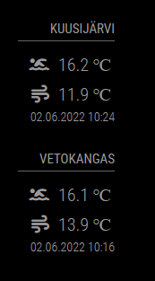

# Module for [MagicMirror](https://magicmirror.builders/): Swim water temperature (Finland metropolitan area)

The `MMM-swim-water-temperature` module fetches swim water temperature from Forum Virium Helsinki api (Finland) and shows the swim water temperature for configured measurement point.


## Screenshot

- Swim water temperature screenshot



## Using the module

1) Clone this repository under `MagicMirror/modules` folder
2) Run `npm install` in `MagicMirror/modules/MMM-swim-water-temperature` folder
3) Add to the modules array in the `MagicMirror/config/config.js` file:
````javascript
modules: [{
	module: "MMM-swim-water-temperature",
	position: "top_right",
	header: "Kuusijärvi",
	config: {
		sensor: "70B3D57050001ADA",
		waterIcon: "person-swimming",
		airIcon: "wind",
		updateInterval: 30 * 60 * 1000, // every 30 minutes
		apiUrl: "https://iot.fvh.fi/opendata/uiras/uiras2_v1.json"
	}
}]
````

## Configuration options

The following properties can be configured:


| Option                       	| Description
| -----------------------------	| -----------
| `sensor`						| Sensor identifier, default `70B3D57050001ADA`. See others: https://iot.fvh.fi/opendata/uiras/uiras-meta.json
| `waterIcon`						| Showed water temperature icon style class, default `person-swimming`. See others: https://fontawesome.com/icons?d=gallery
| `airIcon`						| Showed air temperature icon style class, default `wind`. See others: https://fontawesome.com/icons?d=gallery
| `updateInterval`				| Update interval in milliseconds, default `1800000`
| `apiUrl`						| Api url, default: `https://iot.fvh.fi/opendata/uiras/uiras2_v1.json`
